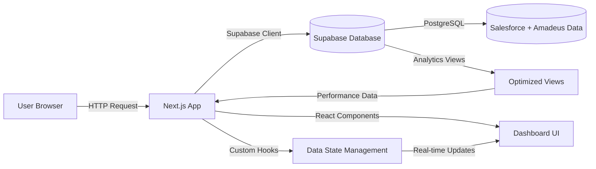

# Dashboard Project Architecture Documentation

**Generated:** December 3, 2024  
**Project:** Task Mining Dashboard with Supabase Integration  
**Version:** 1.0.0

## Executive Summary

This is a **Next.js 15** dashboard application that provides real-time analytics for process mining data from Salesforce and Amadeus systems. The application integrates with **Supabase** for data storage and analytics, featuring a modern React-based UI with TypeScript and Tailwind CSS.

**Key Capabilities:**
• Real-time dashboard with Salesforce and Amadeus data integration  
• AI-powered Task Mining Assistant for data insights  
• Team performance analytics and resource utilization tracking  
• Process flow analysis with bottleneck identification  
• Responsive design with shadcn/ui components  

## Tech Stack Overview

### Frontend Framework
- **Next.js 15.2.4** - React framework with App Router
- **React 19** - Latest React with concurrent features
- **TypeScript 5** - Full type safety throughout the application

### UI & Styling
- **Tailwind CSS 4.1.9** - Utility-first CSS framework
- **shadcn/ui** - Pre-built component library with Radix UI primitives
- **Lucide React** - Icon library for consistent visual elements

### Data & State Management
- **@supabase/supabase-js 2.56.0** - Official Supabase client
- **React Hooks** - Custom hooks for data fetching and state management
- **Zod 3.25.67** - Schema validation and type inference

### Development Tools
- **PostCSS 8.5** - CSS processing pipeline
- **ESLint** - Code quality (configured to ignore during builds)
- **TypeScript** - Static type checking (configured to ignore during builds)

## How Supabase is Integrated

### Client Configuration
The Supabase client is configured in `lib/supabase.ts` with hardcoded credentials:

```typescript
const supabaseUrl = 'https://tjcstfigqpbswblykomp.supabase.co'
const supabaseAnonKey = 'eyJhbGciOiJIUzI1NiIsInR5cCI6IkpXVCJ9...'
export const supabase = createClient(supabaseUrl, supabaseAnonKey)
```

**⚠️ SECURITY RISK:** Credentials are hardcoded in the client bundle, exposing them to all users.

### Database Schema
The application uses two main data sources:

#### Salesforce Data (`salesforce_data`)
- **Structure:** Case tracking, resource utilization, team performance
- **Key Fields:** Case_ID, Resource, Team, Window, Activity, duration_seconds
- **Analytics:** Team stats, resource stats, window usage patterns

#### Amadeus Data (`amadeus_data`)
- **Structure:** Process mining data with detailed workflow tracking
- **Key Fields:** Case_ID, agent_profile_id, Window, Activity, Step, timestamps
- **Analytics:** Case duration, agent performance, application usage, process flow

### Data Access Patterns
- **Client-side fetching** via React hooks (`useSupabaseData`)
- **Real-time updates** through Supabase subscriptions
- **Optimized views** for common analytics queries
- **Row Level Security (RLS)** enabled but configured for public read access

### Authentication & Security
- **Anonymous access** enabled for public dashboard viewing
- **RLS policies** allow read access for all users
- **No user authentication** implemented in current version

## How Vercel is Configured

### Build Configuration
The project uses a minimal `next.config.mjs`:

```javascript
const nextConfig = {
  eslint: { ignoreDuringBuilds: true },
  typescript: { ignoreBuildErrors: true },
  images: { unoptimized: true }
}
```

**⚠️ DEVELOPMENT RISK:** Build errors and linting issues are ignored, which could mask production issues.

### Deployment Features
- **Static Export Ready** - Images are unoptimized for static hosting
- **Edge Runtime Compatible** - Can run on Vercel Edge Functions
- **Environment Variables** - Supabase credentials need to be configured in Vercel dashboard

### Build Commands
```bash
npm run build    # Next.js build
npm run dev      # Development server
npm run start    # Production server
```

## Data Flow Architecture



### Data Flow Details
1. **Initial Load:** `useSupabaseData` hook fetches all required data on component mount
2. **Real-time Updates:** Supabase client provides live data updates
3. **Filtering:** Client-side filtering with Supabase queries
4. **Analytics:** Pre-computed views for performance metrics
5. **State Management:** React state for UI interactions and data caching

## Key Routes & Modules

| Path | Purpose | Server/Client | Notes |
|------|---------|---------------|-------|
| `/` | Main Dashboard | Client | Renders dashboard with tabs |
| `/app/layout.tsx` | Root Layout | Server | HTML structure and fonts |
| `/app/page.tsx` | Dashboard Page | Client | Main dashboard component |
| `/components/dashboard-canvases.tsx` | Tab Navigation | Client | Manages dashboard sections |
| `/hooks/use-supabase-data.ts` | Data Management | Client | Central data fetching hook |
| `/lib/supabase.ts` | Database Client | Client | Supabase configuration |

### Component Architecture
- **Dashboard Header** - Navigation and branding
- **Dashboard Filters** - Team and resource filtering
- **Dashboard Canvases** - Tabbed content areas
- **Chart Components** - Recharts-based visualizations
- **Task Mining Assistant** - AI-powered chat interface

## Risks & Recommendations

### P1: Critical Security Issues (Must Fix)

#### R1: Exposed Supabase Credentials
- **Risk:** Hardcoded credentials in client bundle expose database access
- **Impact:** Unauthorized database access, potential data breaches
- **Fix:** Move to environment variables
- **Effort:** 2 hours
- **Evidence:** `lib/supabase.ts:4-5`

#### R2: Public Database Access
- **Risk:** RLS policies allow anonymous read access to all data
- **Impact:** Sensitive business data exposed to public
- **Fix:** Implement proper authentication and RLS policies
- **Effort:** 1 day
- **Evidence:** `scripts/setup-database.sql:35-40`

### P2: Performance & Reliability Issues (Should Fix)

#### R3: No Error Boundaries
- **Risk:** Unhandled errors crash entire dashboard
- **Impact:** Poor user experience, potential data loss
- **Fix:** Implement React Error Boundaries
- **Effort:** 4 hours
- **Evidence:** `app/page.tsx:18-26`

#### R4: Build Quality Issues
- **Risk:** ESLint and TypeScript errors ignored during builds
- **Impact:** Production bugs, technical debt accumulation
- **Fix:** Fix linting errors and enable strict builds
- **Effort:** 1-2 days
- **Evidence:** `next.config.mjs:3-6`

#### R5: No Data Validation
- **Risk:** Invalid data from Supabase could crash application
- **Impact:** Application instability, incorrect analytics
- **Fix:** Implement Zod schema validation
- **Effort:** 1 day
- **Evidence:** `lib/supabase.ts:15-80`

### P3: Enhancement Opportunities (Nice to Have)

#### R6: Missing Caching Strategy
- **Risk:** Repeated API calls to Supabase
- **Impact:** Higher costs, slower performance
- **Fix:** Implement React Query or SWR for caching
- **Effort:** 2-3 days

#### R7: No Offline Support
- **Risk:** Dashboard unusable without internet
- **Impact:** Reduced productivity in offline scenarios
- **Fix:** Implement service worker and offline data
- **Effort:** 3-5 days

#### R8: Limited Testing
- **Risk:** No automated testing coverage
- **Impact:** Regression bugs, deployment risks
- **Fix:** Add Jest/React Testing Library tests
- **Effort:** 1-2 weeks

## Local Development & Deployment Steps

### Prerequisites
- Node.js 18+ and npm/pnpm
- Supabase project with database setup
- Vercel account (for deployment)

### Local Development
```bash
# Clone and setup
git clone <repository>
cd dashboard-project
npm install

# Environment setup
cp .env.example .env.local
# Add your Supabase credentials

# Database setup
# Run scripts/setup-database.sql in Supabase SQL Editor
# Run scripts/setup-amadeus-database.sql for Amadeus data

# Upload data
node scripts/upload-to-supabase.js
node scripts/upload-amadeus-to-supabase.js

# Start development
npm run dev
```

### Vercel Deployment
```bash
# Build and deploy
npm run build
vercel --prod

# Environment variables in Vercel dashboard:
NEXT_PUBLIC_SUPABASE_URL=https://your-project.supabase.co
NEXT_PUBLIC_SUPABASE_ANON_KEY=your-anon-key
```

## Appendix: Critical Files Inventory

| File | Purpose | Critical Level |
|------|---------|----------------|
| `lib/supabase.ts` | Database client configuration | 🔴 Critical |
| `hooks/use-supabase-data.ts` | Data fetching and state management | 🔴 Critical |
| `components/dashboard-canvases.tsx` | Main dashboard navigation | 🟡 Important |
| `app/page.tsx` | Dashboard entry point | 🟡 Important |
| `scripts/setup-database.sql` | Database schema definition | 🟡 Important |
| `next.config.mjs` | Build configuration | 🟡 Important |
| `package.json` | Dependencies and scripts | 🟡 Important |

## Executive Email Draft

**Subject:** Dashboard Project - Security & Performance Review Required

**Body:**

The Task Mining Dashboard project has been successfully developed with Next.js and Supabase integration, providing real-time analytics for Salesforce and Amadeus process data. However, a security review has identified critical issues that require immediate attention:

**Critical Issues (P1):**
1. **Database credentials are exposed** in the client-side code, creating a security vulnerability
2. **Public database access** is enabled without authentication controls

**Immediate Actions Required:**
- Move Supabase credentials to environment variables (2 hours)
- Implement proper authentication and access controls (1 day)
- Deploy security fixes before production use

**Current Status:**
- ✅ Dashboard functionality complete with AI assistant
- ✅ Real-time data integration working
- ✅ Responsive UI with modern components
- ❌ Security vulnerabilities present
- ❌ No error handling or validation

**Recommendation:** Halt production deployment until security issues are resolved. The development team can address these issues within 1-2 days.

**Next Steps:**
1. Security review and credential management
2. Authentication implementation
3. Performance optimization
4. Testing and validation
5. Production deployment

Please let me know if you need any clarification or have questions about the implementation plan.
